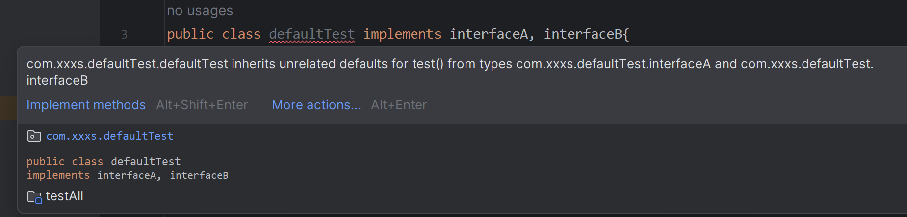

# Bean 的实例化策略


现在 bean 是在 `AbstractAutowireCapableBeanFactory` 里的 `doCreateBean` 方法中，用 `newInstance()` 进行实例化的，仅适用于 bean 有无参构造函数的情况。

```java
protected Object doCreateBean(String beanName, BeanDefinition beanDefinition){
    Class beanClass = beanDefinition.getBeanClass();
    Object bean = null;
    
    try {
        bean = beanClass.getDeclaredConstructor().newInstance();
    } catch (Exception e) {
        throw new BeansException("Instantiation of bean is failed.", e);
    }
    
    addSingleton(beanName, bean);
    return bean;
}
```


针对 bean 的实例化，抽象出一个实例化策略的接口 InstantiationStrategy，有两个实现类：

- SimpleInstantiationStrategy，使用 bean 的构造函数来实例化。
- CglibSubclassingInstantiationStrategy，使用 CGLIB 动态生成子类。


## InstantiationStrategy 接口

源码的同名接口定义了几个实例化方法，这里简化了。

```java
public interface InstantiationStrategy {
    Object instantiate(BeanDefinition beanDefinition) throws BeansException;
}
```


## SimpleInstantiationStrategy

```java
public class SimpleInstantiationStrategy implements InstantiationStrategy {
    @Override
    public Object instantiate(BeanDefinition beanDefinition) throws BeansException {
//        简单的 bean 实例化策略，根据 bean 的无参构造实例化对象
        Class beanClass = beanDefinition.getBeanClass();
        try {
            return beanClass.getDeclaredConstructor().newInstance();
        } catch (Exception e) {
            throw new BeansException("Failed to instantiate '" + beanClass.getName() + "'.", e);
        }
    }
}
```


## CGLib

之前也没深入了解过，就今天一次都写了。


- **CGLib（Code Generation Library**）是一个强大的字节码操作库，常用于实现**动态代理**和**类的增强**。与 Java 标准库的动态代理不同，CGLib 在代理时不需要目标类实现接口，这使得它在某些场景下更加灵活。


- CGLib 的动态代理机制是通过==**生成目标类的子类**==来实现的。

  当需要代理一个类时，CGLib 会创建一个该类的子类，并在子类中重写需要代理的方法。

  这允许在方法调用前后插入自定义逻辑，实现方法的增强。


### CGLib 使用步骤

以下是使用 CGLib 的简单例子。

- 引入 CGLib 库的依赖。

  ```java
  <dependency>
      <groupId>cglib</groupId>
      <artifactId>cglib</artifactId>
      <version>3.3.0</version>
  </dependency>
  ```

- 定义一个需要被代理的目标类。

  ```java
  public class TargetObject {
      public String method1(String str) { return str; }
      public int method2(int i) { return i; }
      @Override
      public String toString() { return "TargetObject []" + getClass(); }
  }
  ```

- 定义一个拦截器，在调用目标方法时，CGLib 会回调 `MethodInterceptor` 接口方法拦截，来实现我们自己的代理逻辑，类似于 JDK 中的 InvocationHandler 接口。

  ```java
  public class TargetInterceptor implements MethodInterceptor{
      @Override
      public Object intercept(Object obj, Method method, Object[] params,
              MethodProxy proxy) throws Throwable {
          System.out.println("调用前");
          Object result = proxy.invokeSuper(obj, params);
          System.out.println("调用后"+result);
          return result;
      }
  }
  ```

- 生成动态代理类。

  ```java
  public class TestCglib {
      public static void main(String args[]) {
          Enhancer enhancer = new Enhancer();
          enhancer.setSuperclass(TargetObject.class);
          enhancer.setCallback(new TargetInterceptor());
          TargetObject targetObject = (TargetObject) enhancer.create();
          System.out.println(targetObject);
          System.out.println(targetObject.method1("mmm1"));
          System.out.println(targetObject.method2(100));
      }
  }
  ```

  - Enhancer 类是 CGLib 中的一个字节码增强器，它可以方便的对想要处理的类进行扩展。


### 与 Java 标准动态代理的对比

- 都是为了在运行中解决代理的问题。

- cglib 是来自于第三方包，基于ASM来实现的，内部比较复杂；

  jdk 是自带的，会随着jdk版本升级与更新。


最大的区别是 cglib 可以直接操作没有实现接口的类，相当于 jdk proxy 而言：

1. 无**接口限制**
2. **继承代理**： 字节码中可以看出是直接 extends xxx 生成的代理类
3. **调优性能优化**：在 CGLIB 中，方法调用被转发到目标方法的方式更加直接，不需要通过 `InvocationHandler` 的 `invoke `方法来间接调用。这样可以避免一层反射调用。
4. **缓存机制：** CGLIB 在生成代理类时会缓存已经生成过的类，避免重复生成。这在创建多个相同代理类实例时可以提高性能。JDK 动态代理在每次生成新的代理实例时都会重新生成相应的字节码。


### CGLib 局限性

不支持 final 修饰的场景。遇到这种情况可以用 jdk proxy。


## CglibSubclassingInstantiationStrategy

```java
public class CglibSubclassingInstantiationStrategy implements InstantiationStrategy {
    @Override
    public Object instantiate(BeanDefinition beanDefinition) throws BeansException {
        Enhancer enhancer = new Enhancer();
        enhancer.setSuperclass(beanDefinition.getBeanClass());
        enhancer.setCallback((MethodInterceptor) (obj, method, args, proxy) -> proxy.invokeSuper(obj, args));
        return enhancer.create();
    }
}
```


## AbstractAutowireCapableBeanFactory

这里改一下 `doCreate()`，默认就用 bean 的构造函数来实例化。

```java
private InstantiationStrategy instantiationStrategy = new SimpleInstantiationStrategy();

protected Object doCreateBean(String beanName, BeanDefinition beanDefinition) {
    Object bean = null;
    
    try {
        bean = getInstantiationStrategy().instantiate(beanDefinition);
    } catch (Exception e) {
        throw new BeansException("Instantiation of bean is failed.", e);
    }

    addSingleton(beanName, bean);
    return bean;
}
// 省略 instantiationStrategy 的 setter/getter
```


# default 关键字


看 Spring 源码的时候发现 InstantiationStrategy 这个接口最下面有个 `default` 标识的默认方法，正好拓展一下，源码方法如下：

```java
/**
  * Determine the actual class for the given bean definition, as instantiated at runtime.
  * @since 6.0
  */
default Class<?> getActualBeanClass(RootBeanDefinition bd, @Nullable String beanName, BeanFactory owner) {
    return bd.getBeanClass();
}
```

顾名思义，default 关键字的用法很好理解，考虑以下场景：

​	假如某个接口所有实现类都具有一个同样的功能，那么每次写这个接口的实现类时，都需要重复去写同一个功能，其实是没必要的。

针对这个问题，用 default 就可以解决。

- default 修饰的目的是让接口可以拥有具体的方法，让接口内部包含了一些默认的方法实现。
- 被 default 修饰的方法是接口的默认方法。既只要实现该接口的类，都具有这么一个默认方法，默认方法也可以被重写。


**==注意==**：如果一个类实现了两个接口，这两个接口又同时都包含了一个名字相同的 default 方法，那么会发生什么情况？ 

举个非常简单的例子：

```java
public interface interfaceA {
    default void test(){
        System.out.println("test in interfaceA");
    }
}
```

```java
public interface interfaceB {
    default void test(){
        System.out.println("test in interfaceB");
    }
}
```

最后会发现编译器报错了，因为编译器不知道应该在两个同名的 default 方法中选择哪一个，产生了二义性。



