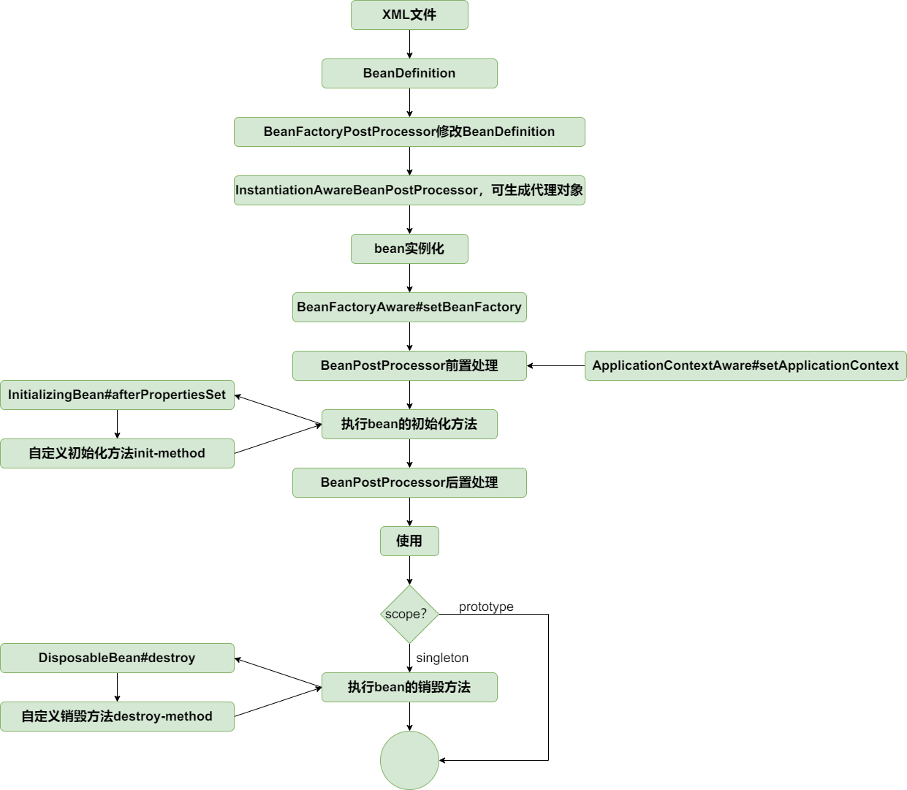

## 动态代理融入 bean 生命周期

结合前面的 bean 的生命周期，BeanPostProcessor 处理阶段可以修改和替换 bean，正好可以在此阶段返回代理对象替换原对象。

不过我们引入一种特殊的 BeanPostProcessor——InstantiationAwareBeanPostProcessor，如果 InstantiationAwareBeanPostProcessor 处理阶段返回代理对象，会导致短路，不会继续走原来的创建 bean 的流程，具体实现查看 AbstractAutowireCapableBeanFactory#resolveBeforeInstantiation。

DefaultAdvisorAutoProxyCreator 是处理横切逻辑的织入返回代理对象的 InstantiationAwareBeanPostProcessor 实现类，当对象实例化时，生成代理对象并返回。

至此，bean的生命周期如下：

