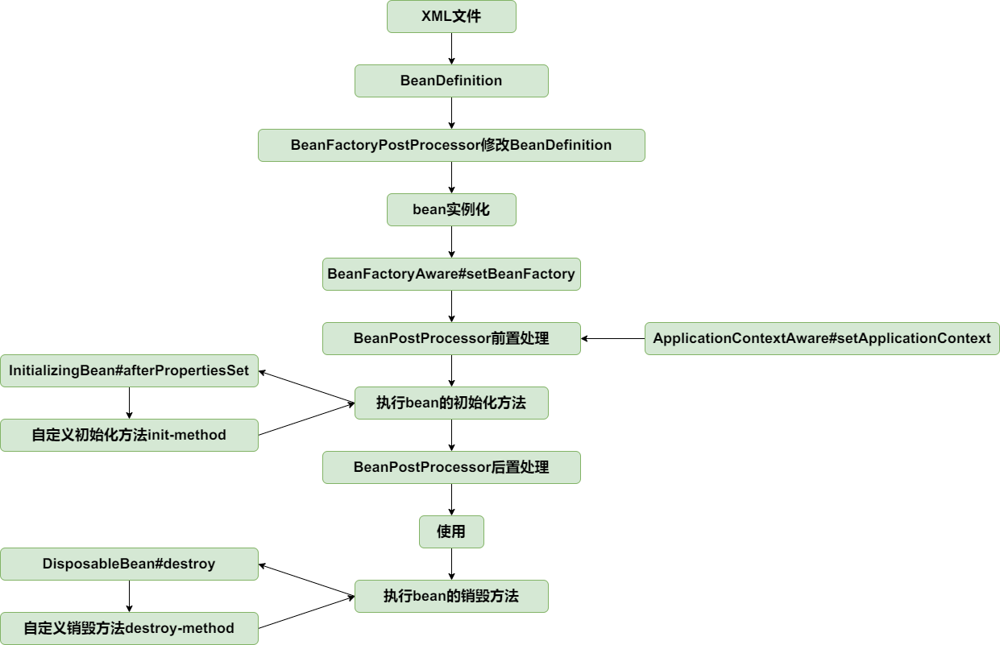

在 Spring 框架中，`Aware` 接口是一类用于提供特定功能或数据访问的接口，它使得 Bean 能够感知到 Spring 容器的某些状态或数据。实现这些接口的 Bean 可以获得对 Spring 容器资源或者环境的感知和访问能力。

一些常见的 `Aware` 接口及其用途：

1. **`ApplicationContextAware`**：允许 Bean 访问 Spring 的应用上下文。Bean 可以通过这种方式获取到容器的各种配置和服务。
2. **`BeanNameAware`**：允许 Bean 获得其在 Spring 容器中的名字。这对于需要根据 Bean 的名称执行特定操作的场景非常有用。
3. **`BeanFactoryAware`**：使 Bean 能够访问 Spring 容器的 `BeanFactory`，这是 Spring 的工厂模式的实现，负责生成其他 Bean。
4. **`ResourceLoaderAware`**：允许 Bean 获取资源加载器，从而可以加载外部资源。
6. **`EnvironmentAware`**：提供对 Spring 运行环境的访问，可以用来获取环境变量等配置。

通过实现这些接口，Bean 可以在运行时获得必要的上下文信息，从而执行更复杂的逻辑。这些接口是 Spring 框架与 Bean 交互的重要机制之一，增加了框架的灵活性和扩展性。


## BeanFactoryAware


让实现 `BeanFactoryAware` 接口的类能感知所属的 BeanFactory。

AbstractAutowireCapableBeanFactory#initializeBean：

```java
if (bean instanceof BeanFactoryAware) {
	((BeanFactoryAware) bean).setBeanFactory(this);
}
```


实现 `ApplicationContextAware` 的接口感知 ApplicationContext，是通过 `BeanPostProcessor`。

由 bean 的生命周期可知，bean 实例化后会经过 BeanPostProcessor 的前置处理和后置处理。

定义一个 BeanPostProcessor 的实现类 `ApplicationContextAwareProcessor`。

在AbstractApplicationContext#refresh 方法中加入到 BeanFactory 中，在前置处理中为 bean 设置所属的ApplicationContext。

```java
// 添加 ApplicationContextAwareProcessor，让继承 ApplicationContextAware 的 bean 能感知
beanFactory.addBeanPostProcessor(new ApplicationContextAwareProcessor(this));
```


最后，改用 dom4j 解析 xml 文件。


至止，bean的生命周期如下：

