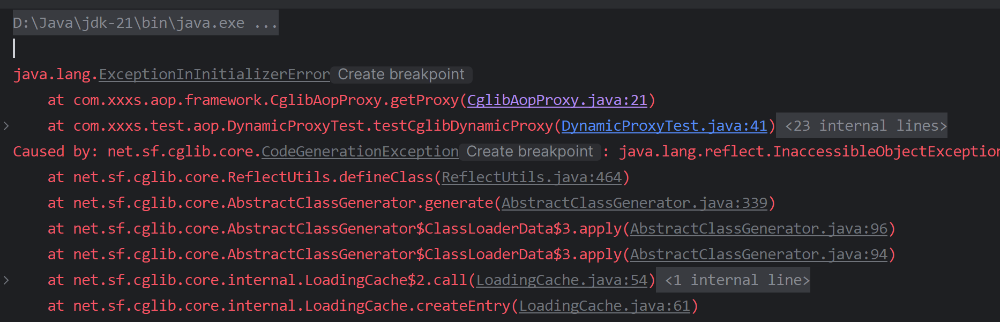
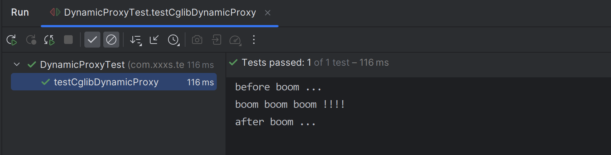

与基于 JDK 的动态代理在运行期间为接口生成对象的代理对象不同，基于 CGLIB 的动态代理能在运行期间**动态构建字节码的 class 文件**，为类生成子类，因此被代理类不需要继承自任何接口。


有一个问题，测试的时候用 jdk8 没问题，21 会报错 java.lang.reflect.InaccessibleObjectException：



这是因为在 9 及更高版本中引入了模块化系统（Project Jigsaw），对反射访问的控制更严格了。对未开放的模块和包的反射访问，可能会导致 `java.lang.reflect.InaccessibleObjectException` 异常。

解决方案：

Run —> EditConfigurations… —> Modify options —> Add VM options 添加下面指令：

```java
--add-opens java.base/java.lang=ALL-UNNAMED
```

格式为：`--add-opens <module>/<package>=<target>`

- `<module>`：模块名
- `<package>`：包名
- `<target>`：目标模块或包，可以是 `ALL-UNNAMED`（适用于所有未命名模块）


然后就 ok 了。



