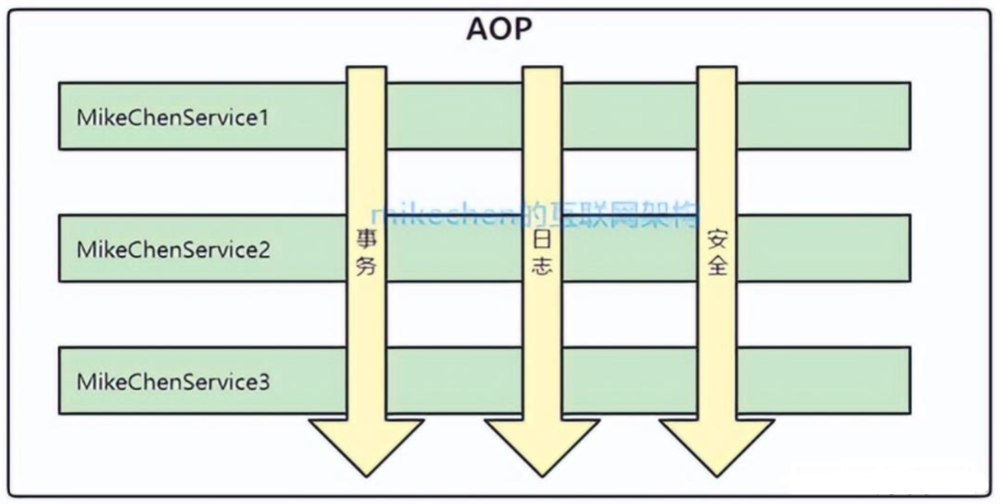

## AOP 的定义

**AOP （Aspect Orient Programming）面向切面编程**，AOP 是一种编程思想，是面向对象编程（OOP）的一种补充。

面向切面编程，实现在不修改源代码的情况下给程序 **动态** **统一** 添加额外功能的一种技术，如下图所示：

## AOP 的作用

AOP 采取**横向**抽取机制（动态代理），取代了传统纵向继承机制的重复性代码，其应用主要体现在**事务处理**、**日志管理**、**权限控制**、**异常处理**等方面。

主要作用是分离功能性需求和非功能性需求，使开发人员可以集中处理某一个关注点或者横切逻辑，减少对业务代码的侵入，增强代码的可读性和可维护性。

简单的说，AOP 的作用就是保证开发者在不修改源代码的前提下，为系统中的业务组件添加某种通用功能。

---

Joinpoint 指需要执行代理操作的某个类的某个方法（仅支持方法级别的 JoinPoint）；

Pointcut 是 JoinPoint 的表述方式，能捕获 JoinPoint。

最常用的切点表达式是 AspectJ 的切点表达式。

需要匹配类，定义 ClassFilter 接口；匹配方法，定义 MethodMatcher 接口。PointCut 需要同时匹配类和方法，包含 `ClassFilter` 和 `MethodMatcher`，AspectJExpressionPointcut 是支持 AspectJ 切点表达式的 PointCut 实现，简单实现仅支持 execution 函数。