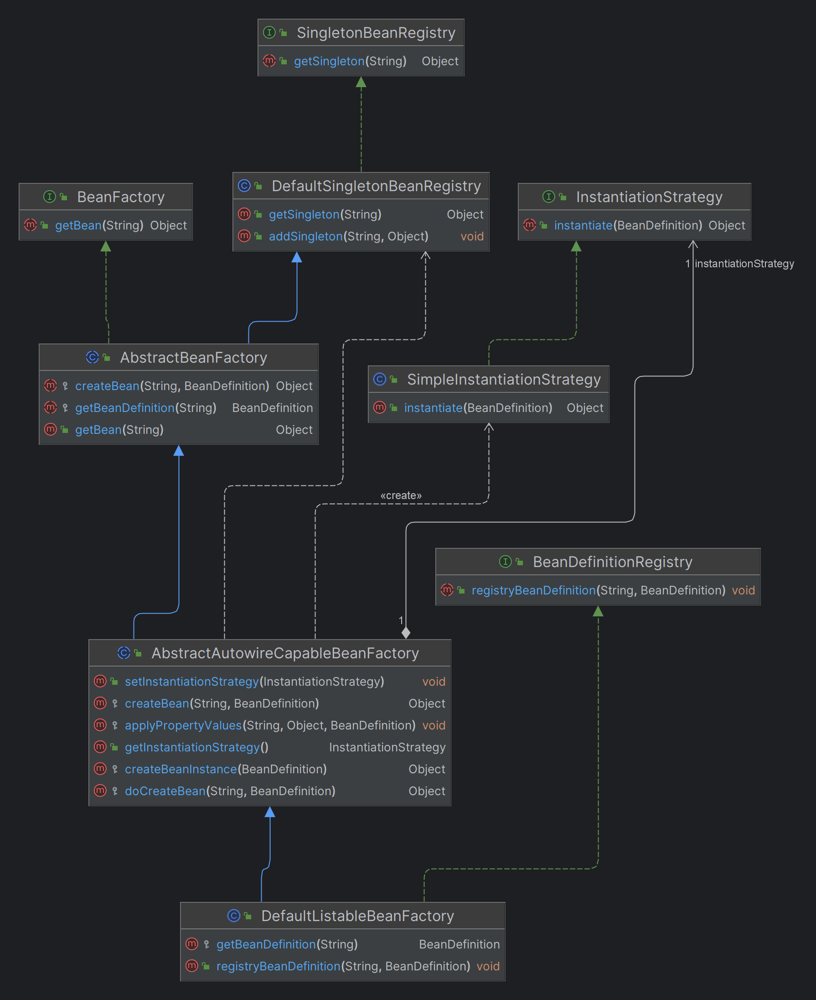

Spring 框架中的 `BeanReference` 是一个接口，用于表示对 Spring 容器中管理的其他 bean 的引用。

简单来说就是，允许一个bean在需要时引用另一个bean。


## BeanReference的实现

主要的 `BeanReference` 实现类是 `RuntimeBeanReference` 和 `RuntimeBeanNameReference` 。

这提供了不同方式来解析对其他bean的引用。

1. **RuntimeBeanReference**：通过 bean 的名称来引用另一个bean。在 Spring 容器运行时，这个引用会被解析为实际的 bean 实例。
2. **RuntimeBeanNameReference**：这个实现类返回 bean 的名称而不是 bean 的实例。

第一个实现类更常用。


## BeanReference

简化了一下，先直接把 `BeanReference` 写成类了。

```java
public class BeanReference {
    private final String beanName;

    public BeanReference(String beanName) {
        this.beanName = beanName;
    }

    public String getBeanName(){
        return beanName;
    }
}
```

---

最后放个类图，五一出去玩了几天回来又有点忘了细节。

