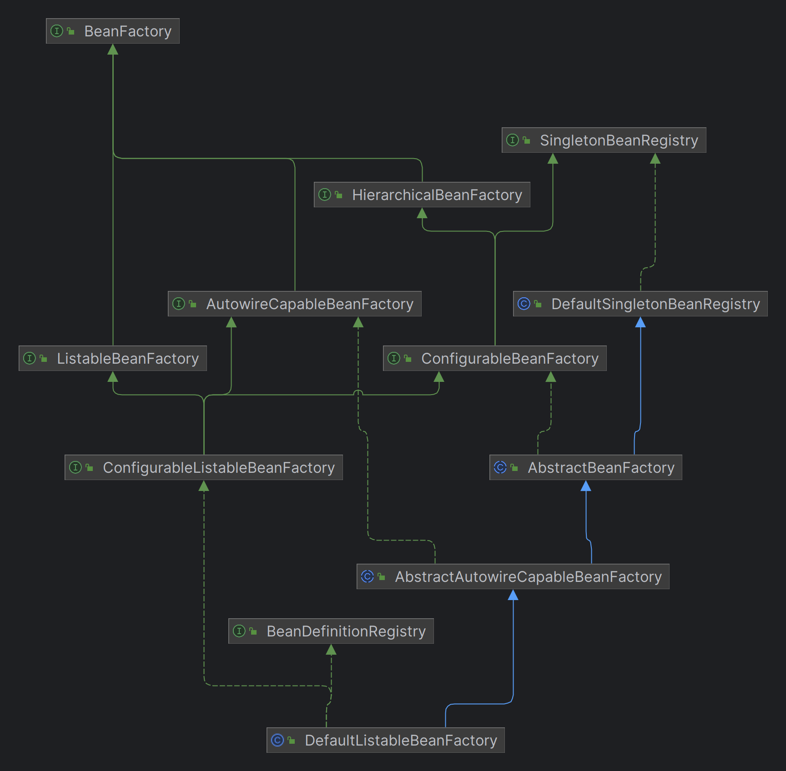

## 在 xml 文件中定义 bean

有了资源加载器，就可以在 xml 格式配置文件中声明式地定义 bean 的信息：

​	资源加载器读取 xml 文件，解析出 bean 的信息，然后往容器中注册 BeanDefinition。

- `BeanDefinitionReader` 是读取 bean 定义信息的抽象接口。
- `XmlBeanDefinitionReader` 是从 xml 文件中读取的实现类。
- `BeanDefinitionReader` 需要有获取资源的能力，且读取 bean 定义信息后需要往容器中注册 BeanDefinition，因此 BeanDefinitionReader 的抽象实现类 `AbstractBeanDefinitionReader` 拥有 ResourceLoader 和 BeanDefinitionRegistry 两个属性。

由于从 xml 文件中读取的内容是 String 类型，所以属性仅支持 String 类型和引用其他 Bean。

后面会补充属性编辑器 PropertyEditor，实现类型转换。

---

又调整了 Bean Factory 的层次结构：

